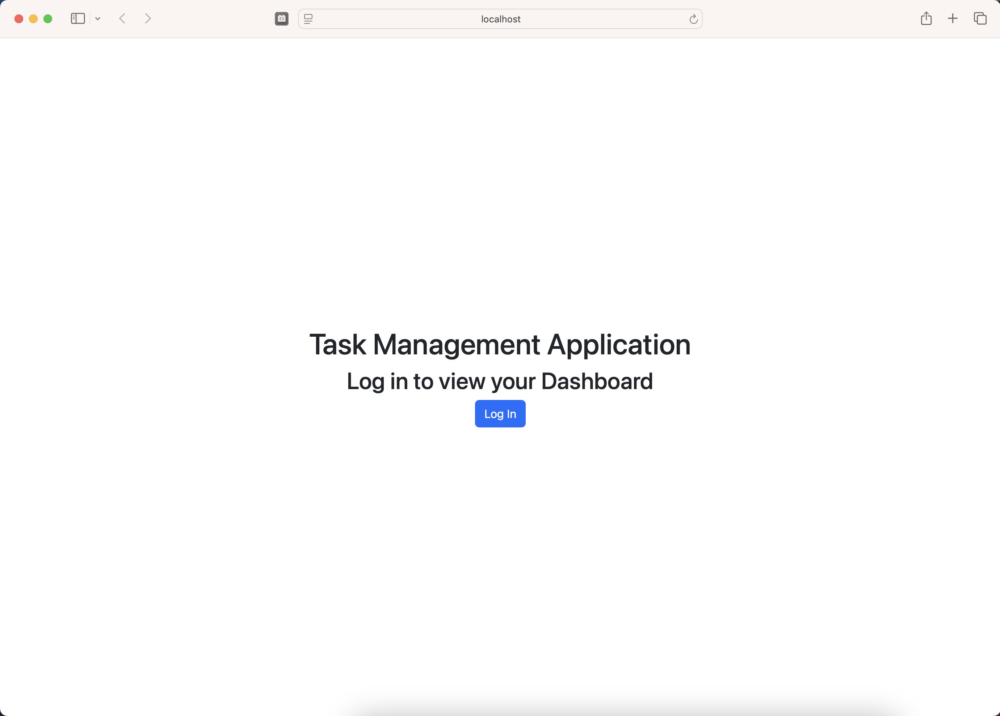
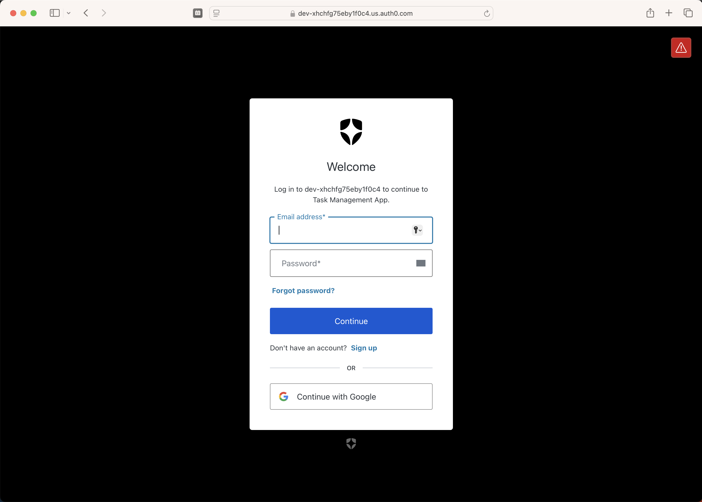
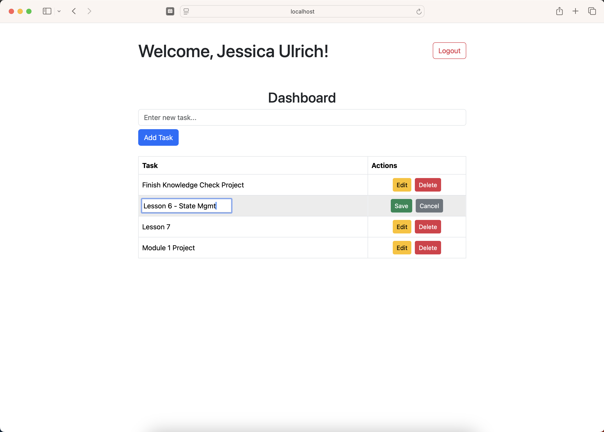

# Task Management App with TypeScript

The Task Management Application built with TypeScript is an application that expands on previous knowledge of React and JavaScript and utilizes Bootstrap for styling.  It allows a user to "log in" to their account using the services of Auth0 to view their Dashboard.  Once in their Dashboard, the user is able to add new tasks, edit existing ones, or delete them altogether.  

## Installation 

1. Clone this repository: 
```bash
git clone https://github.com/jessicaanne0982/FE_Mod1_Task_Mgmt_with_TypeScript.git
```
2. Within the terminal, navigate to the TypeScript-Task-Management-App directory: 
```bash
cd TypeScript-Task-Management-App
```
3. Install the required dependency:
```bash
npm install
```
4. Run the application in development mode: 
```bash
npm run dev
```

5. Open [http://localhost:5173/](http://localhost:5173/) to view the application in the browser.

### *** NOTE ***
Please ensure you are using http://localhost:5173 when running this application. Running on any other server will cause the authorization/authentication processes to fail.


## Usage


On the Landing Page, the user is prompted to Login to their account to see their Task Dashboard.


Here, the user is able to use their Google account to log in.


When logged in, the user is able to Add Tasks through the use of a small form at the top of the page.  Once added, the user is able to see their tasks in a table as well as Edit and/or Delete each task.  Clicking on Edit allows the user to update their task and either Save or Cancel their changes.


## GitHub Link

[Task Management App with TypeScript](https://github.com/jessicaanne0982/FE_Mod1_Task_Mgmt_with_TypeScript.git)